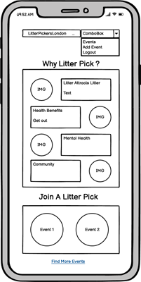
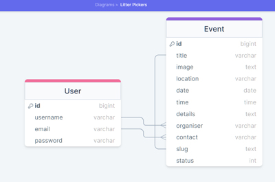

# **Litter Pickers London - Introduction**
Litter Pickers London is a site dedicated to spreading the word about Litter Picking and creating a community via user-organised litter picking events. This project is a Full-Stack development website built using the Django framework and employing full CRUD functionality. Litter Pickers London allows registered users to create organised Litter Pick Events in any of the boroughs of London.  These events can then be displayed on the Events page and signed in users can edit or delete any Litter Pick they have create don the site. Registered users can also interact by showing that they are attending an event or commenting on the details pages.

[View the live project here](https://pickers-london-f5f0f470e555.herokuapp.com).

## **TABLE OF CONTENTS**

 - [**User Experience (UX)**](#user-experience)
    * [User Stories](#user-stories)
    * [Agile Methodology](#agile-methodology)
    * [The Scope](#the-scope)
 - [**Design**](#design)
    * [Colours](#colours)
    * [Typography](#typography)
    * [Media](#media)
    * [Wireframes](#wireframes)
    * [Database Schema](#database-schema)
 - [**Features**](#features)
   * [Navigation](#navigation)
   * [Footer](#footer)
   * [Home Page](#home-page)
   * [Events Page](#events-page)
   * [Event Details Page](#event-details-page)
   * [Add Event Page](#add-event-page)
   * [Edit Event Page](#edit-event-page)
   * [Delete Event Page](#delete-event-page)
   * [Attending Button](#attending-button)
   * [Comment Counter](#comment-counter)
   * [Comments](#comments)
   

 - [**Testing**](#testing)
 - [**Technologies Used**](#technology-used)
 - [**Deployment**](#deployment)
 - [**Credits**](#credits)

## **USER EXPERIENCE (UX)**

### **User Stories**

### ADMIN FEATURES ###
* As a **manager of the site** I can **login to the admin panel** so that **I can manage the site**.
* As a **site administrator** I can **use the admin panel to filter and search content and use a WYSIWYG editor and auto-generate slugs** so that **I can easily add and manage content**.
* As an **admin** I can **add images in the admin panel** so that **I can add images to events**.

### SITE STRUCTURE ###
* As a **user** I can **view a home page** so that **I can understand what the site is about**.
* As a **user** I can **view an events page** so that **I can see a list of events**.
* As a **user** I can **click a link on the events page** so that **I can see the details of the individual event on a new page**.
* As a **user** I can **see a paginated list of events** so that **I can view a few posts at a time**.
* As a **user** I can **see the total number of attendees for an event** so that **I can see how many people are attending**.

### CONTENT CREATION ###
* As a **user** I can **create an account** so that **I can use the account to add content**.
* As a **user** I can **add comments to an event when logged in** so that **I can add comments to an event**.
* As a **user** I can **mark that I am attending an event** so that **I can show my interest in an event**.
* As a **user** I can **see messages to let me know my action has been carried out** so that **I receive information about my actions**.
* As a **registered user** I can **add an event** so that **I can list my event on the site**.
* As a **registered user** I can **edit my own event** so that **I can correct mistakes and update details**.
* As a **registered user** I can **delete my events** so that **remove my events from the site**.
* As a **registered user** I can **auto complete slugs and organiser fields** so that **they are created automatically**.
* As an **event organiser** I can **prevent others from editing or deleting my events** so that **my events are not edited or deleted by other users**.

### SITE DESIGN ###
* As a **user** I can **view an alert** so that **I know that my comment is awaiting approval**.
* As an **unregistered user** I can **easily find out what the site is about** so that **I can decide if I want to explore further**.
* As a **user** I can **want the site to be responsive** so that **I can view on different devices**.

### **Agile Methodology**

An Agile Approach was followed in the planning and construction of the site.  User stories were built using GitHub Issues, grouped into Epics for different aspects of the site design (structure, administration, content creation etc...), attached to a Milestone and organised onto a board.  Each user story has a list of tasks to tick off and an acceptance criteria.  As stories were built, they were moved to the Not Started column of the board.  Once they were started, they were moved to the In Progress Column and finally, when all tasks were complete, the story was moved to the complete column and marked closed.  Each story was listed in relevant Epic as a task and ticked off when the story was complete.

The project board can be viewed here: [Litter Pickers London Project Board](https://github.com/users/broken-helix/projects/7/views/1).

### **The Scope**

#### **The Site's Main Goals:**
- To provide users with a user-friendly and positive experience when using the site.
- To provide users with a clear understanding of the site's purpose.
- To provide controlled functionality based on a user's permissions.
- To introduce the user to the benefits of litter picking
- To host litter picking events
- To build a community via attending icons and comments
- To build an interactive site using DJANGO with CRUD functionality

## **DESIGN**

### **Colours**
The color scheme was designed to incorporate natural greens, to reflect the environmental topic of the site, along with complementary colors.
Colors were selected using the coolors color palette generator. Changes were made for constrast during the latter parts of development.   

### **Typography**
- The fonts used throughout the site were selected from Google Fonts.
- Fonts were selected for their simple and readable design to avoid distracting from the content.
- Inter, Kanit and Open Sans were selected.
- All fonts were sourced through [Google fonts](https://fonts.google.com/).

### **Media**
- [Balsamiq](https://balsamiq.com/) was used for the design of my wireframes and database schema.
- [Pexels](https://www.pexels.com/) was used for some of the test and default images.
- [Fontawesome](https://fontawesome.com/) was used for the icons on the home page and the attending and comment icons on the Event Details Page.
- [DrawSQL](https://drawsql.app/) was used to sketch out the database models at an early stage.

### **Wireframes**
Wireframes for different views are linked here:

### **Database Schema**

## **FEATURES**

### **Navigation**

#### **Desktop Navigation**
- The navigation bar is located at the top of each page on the site and has a sticky functionality to pin the nav bar at the top of the page when scrolled. This is to allow the user ease of navigation when browsing the site.
- The menu contains links for the 'Home Page', which is also linked via the Brand Logo, the 'Events Page' and  'Login' and 'Register' links. 
- Once the user is logged in the menu the 'Register' link is replaced with the 'Logout Page' link and the 'Logout' link is replaced with the 'Edd Event Page' link.
- The navbar is fully responsive and collapses into a burger menu for mobile devices.

#### **Mobile Navigation**
- Presented as a burger menu for design responsiveness.
- Once clicked a dropdown menu appears including all the page links as above.

### **Footer**
- Located at the bottom of the page the footer contains links to social media platforms. I wanted to keep the footer as simple as possible to allow users easier navigation of the site by keeping any page links in one menu.

### **Home Page**
- Upon landing on the homepage the user is presented with an information box which details the sites' purpose.
- Lower down there are 4 sections, covering different reason why users should Litter Pick.
- These tile into a single row on mobile devices.

### **Events Page**
- The Events page lists all available events in a range of formations, depeding on the screen size.
- Images have been placed into circle containers which reduces the impact of differing aspect ratios on the layout.
- Under each event is a link to the Event Details page specific to that event.

### **Event Details Page**
- The Event Details page provides more information about the event, together with a larger featured image.
- The page will paginate the Build Thread cards to display 8 per page.
- If signed in and the creator of an event, a user will be presented with edit and delete links.
- Each Event Detail card displays the title, details, borough, date, organiser and meeting point.
- Below this is an attending button, and a comments symbol, with respective counts.
- Below the Event Detail card is a comment form and a list of comments, if present.
- All comments have to be approved to be displayed.

#### **Add Event Page**
- The Add Event page is essentially a form to complete.
- The user can add an image via the form, which will be resized by Cloudinary.
- A default image is attached in the event that no image is attached by the user.
- Slugs are auto-generated and are comprised of the title and event id. This means the title does not have to be unique.
- The organiser is automatically added to the Event.

### **Edit Event Page**
- The Edit Event page is only accessible via the link on the Event Details page is the user is signed in and the creator of the event (the organiser).
- Users who circumvent this by typing /edit at the end of the url are met with a 403 Forbidden page and cannot complete the action, ensuring they do not edit others' events.

### **Delete Event Page**
- The Delete Event page is only accessible via the link on the Event Details page is the user is signed in and the creator of the event (the organiser).
- Users who circumvent this by typing /delete at the end of the url are met with a 403 Forbidden page and cannot complete the action, ensuring they do not edit others' events.

### **Attending Button**
- The attending button is located on the attending icon under the Event Details.
- When clicked the counter increments if the user has marked themselves attending and the icon changes and turns a clear green colour.

### **Comment Counter**
- The Comment Counter is under the Event Details on the Event Details page.
- It counts approved comments, so will not change immediately when a post is made, so users are given an alert message to let them know their comment was posted.

### **Comments Section**
- At the bottom of the page all users are able to view the comments section.
- Authenticated users are able to leave comments.

### **Future Features**
- The ability to edit or delete comments.
- A guide to Litter Picking page.
- A blog page where users can submit stories or images of their litter picking.
- An upcoming events section on the Home pgae, displaying the next events.
- Password reset functionality.
- Allow the user to search for events in their borough
- Allow the user to create a personal profile page
- Allow users to add images to comments
- Allow users to use a page to request litter picks in their street or area.

## **ACCOUNTS**

### **Register Account**

### **Log in**

### **Sign out**

### **Access denied**

## **TESTING**

Testing and results can be found [here](TESTING.md)

## **TECHNOLOGIES USED**

### Languages used

- [HTML5](https://en.wikipedia.org/wiki/HTML5)
- [CSS3](https://en.wikipedia.org/wiki/Cascading_Style_Sheets)
- [Javascript](https://en.wikipedia.org/wiki/JavaScript)
- [Python](https://www.python.org/)

### Libraries and Programs Used

- [Git](https://git-scm.com/) 
   Used for version control alongside GitHub.
- [GitHub](https://github.com/) 
   Used to store the project and utilise git version control.
- [Heroku](https://id.heroku.com) 
   Used to deploy project.
- [Cloudinary](https://cloudinary.com/) 
   Cloud based storage, used for storing any media submitted by users.
- [ElephantSQL](https://www.elephantsql.com/) 
   Used to host the PostgreSQL database.
- [W3C - HTML](https://validator.w3.org/) 
   Used to validate all HTML code.
- [W3C - CSS](https://jigsaw.w3.org/css-validator/) 
   Used to validate all CSS code.
- [CI PEP8 Testing](https://pep8ci.herokuapp.com/) 
   Used to validate all Python code.
- [Google Fonts](https://fonts.google.com/) 
   Used to provide the font styling.
- [Bootstrap](https://getbootstrap.com/) 
   Used to for helping with the HTML design and layout.
- [Fontawesome](https://fontawesome.com/) 
   Used to implement effective icons.
- [Google Chrome Dev Tools](https://developer.chrome.com/docs/devtools/) 
   Used during the development to debug and test responsiveness.
- [Balsamiq](https://balsamiq.com/) 
   Used to build both the database schema diagram and design wireframes.
- [DrawSQL](https://drawsql.app) 
   Used to build database diagrams

## **DEPLOYMENT**

### ** Create Github Repository **
- Log in to your Github account.
- Navigate to repositories and select 'New'.
- Select the 'Code Institute' template from the 'Repository Template' menu.
- Give your repository a name and select 'Create Repository'.
- When the repository has been created select 'Gitpod' to open a new workspace.

### ** Heroku **
- Log in to your Heroku account [Heroku](https://id.heroku.com).
- From the home page select 'New', then select 'Create New App' from the drop-down.
- Provide a name for your app and selectyour regrion.
- Add 3 new keys along with your relevant value information: 'SECRET_KEY', 'DATABASE_URL' and 'ClOUDINARY_URL'. 
- At the top of the page select the 'Deploy' tab.
- For the preferred deployment method select 'Github'.
- Search for your repository name and connect.
- Additionally, automatic deploys can be enabled for deployment after each push to Github.

### ** Fork this project **
- Sign in to Github and go to my [repository](https://github.com/broken-helix/keep-it-tidy-london)
- At the top of the page select 'Fork'.
- The Fork will now be added to your repositories.

### ** Clone this project **
- Sign in to Github and go to my [repository](https://github.com/broken-helix/keep-it-tidy-london)
- Select the green 'Code' button.
- Select from one of the cloning options HTTPS, SSH or Github CLI. Click the clipboard icon to copy the URL.
- Open git bash
- Enter ‘git clone’ into the text box and then paste the respository URL and select enter. 

For more information on cloning please read the github documentation [here](https://docs.github.com/en/repositories/creating-and-managing-repositories/cloning-a-repository)

## **Credits**
- [The Code Institutes](https://codeinstitute.net/) 'I Think Therefore I Blog' project which inspired the main functionality of the blog.
- [Stack Overflow](https://stackoverflow.com/) for help with errors encountered during development.
- [W3Schools - Python](https://www.w3schools.com/python/) for reference and research.
- Richard Wells (https://github.com/D0nni387) - Code Institute mentor, without his patience and support I would not have been able to complete my project to a standard that I am happy with.
- Codemy on Youtube (https://www.youtube.com/@Codemycom/playlists) - Some very helpful tutorials on Django.