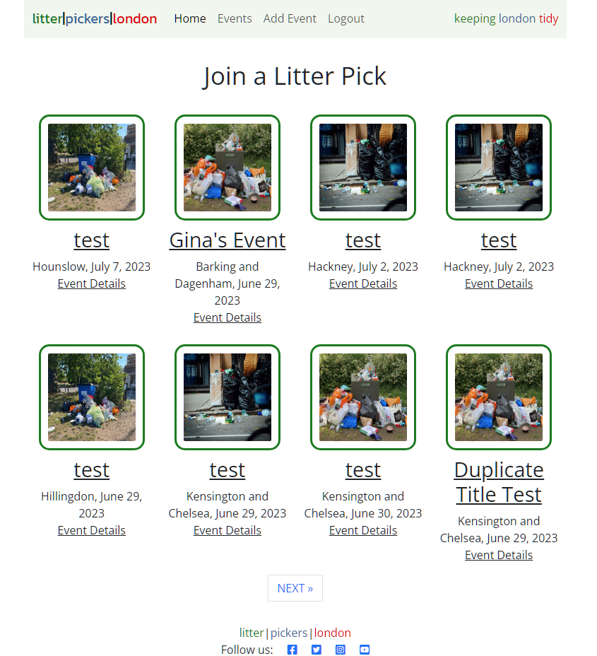
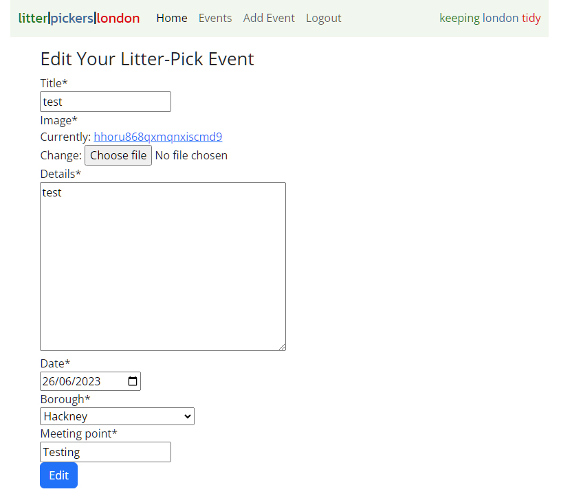

# **Litter Pickers London Testing Documentation**

## **Table of contents**
 - [**HTML Validation**](#html-validation)
 - [**CSS Validation**](#css-validation)
 - [**Python Validation**](#python-validation)
 - [**Lighthouse**](#lighthouse)
 - [**Bugs and Issues**](#bugs-and-issues)

## **HTML Validation**

All HTML code has been run through the [W3C - HTML](https://validator.w3.org/) validator and returns no errors, results can be viewed below:

#### **Index.html**

#### **Events.html**

#### **Event-details.html**

#### **Add-event.html**

#### **Edit-event.html**

#### **Delete-event.html**

## **CSS Validation**

All CSS code has been run through the [W3C - CSS](https://jigsaw.w3.org/css-validator/) validator and returns no errors, results can be viewed below:

## **Python Validation**

All Python code has been run through the [CI PEP8 Testing](https://pep8ci.herokuapp.com/) validator and has returned no errors, results can be viewed below:

#### **admin.py**

#### **app.py**

#### **forms.py**

#### **models.py**

#### **urls.py**

#### **views.py**

## **Lighthouse**
- The lighthouse score results can be found below.

## **Bugs and Issues**
- 